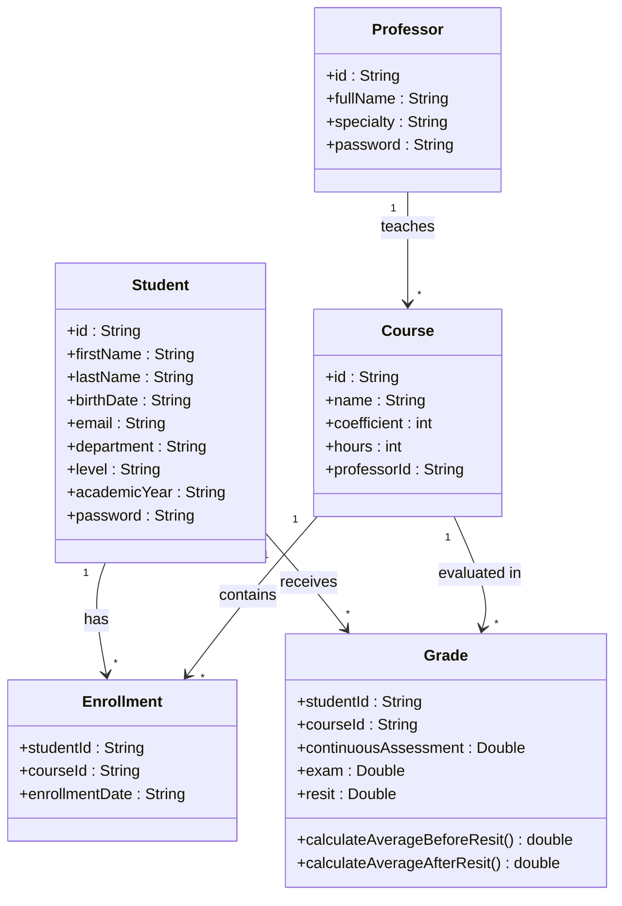

# Conception du projet

## UML

## MLD

- `Student(id PK, first_name, last_name, birth_date, email, department, level, academic_year, password)`
- `Professor(id PK, full_name, specialty, password)`
- `Course(id PK, name, coefficient, hours, professor_id FK -> Professor.id)`
- `Enrollment(student_id FK -> Student.id, course_id FK -> Course.id, enrollment_date, PK(student_id, course_id))`
- `Grade(student_id FK -> Student.id, course_id FK -> Course.id, cc, exam, resit, PK(student_id, course_id))`
